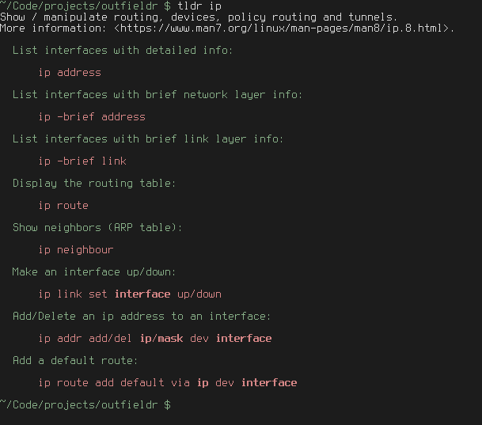

# A [TLDR](https://github.com/tldr-pages/tldr) client in Zig.



# Usage

To view the TLDR page for `chmod`:
```
tldr chmod
```

Works with multiple-word pages as well, for example:
```
tldr git rebase
```

Update your local cache (you'll need to do this before using it for the first time):
```
tldr --update
```

To specify language (in this case, español):
```
tldr --language es bash
```

You can specify the platform too, it defaults to the platform the
source was built for.
```
tldr --platform osx caffeinate
```

You can list all pages, as well as supported languages and operating
systems:
```
tldr --list
tldr --list-languages
tldr --list-platforms
```

Specifying your language/platform alongside `list-pages` works as expected.
```
tldr --language fr --platform linux --list-pages
```

For more, try:
```
tldr --help
```

# Building

You'll need [`zig-0.8.0`](https://ziglang.org/download/) and Git.

First, you need to init and update the submoduled dependencies:
```
git submodule init
git submodule update
```

Then, you can build the project. To build a release-safe binary, run:
```
zig build -Drelease-safe
```

I recommend you build with `-Drelease-safe`. The performance penalty
for runtime safety is quite minimal. If you _gotta go fast_ and want
to disable all runtime safety checks for the most speed possible,
build with `-Drelease-fast` instead. But again, this is not
recommended.

# Performance

This is the fastest tldr client that I am aware of. It runs ~30 times
faster than [Tealdeer](https://github.com/dbrgn/tealdeer/). If someone
knows of a faster client, please open an issue with a link to the
repository and I will update this section.

I benchmarked against a few other tldr programs using
[Hyperfine](https://github.com/sharkdp/hyperfine), including Tealdeer,
the C client, and the official Node.js client. These results were
consistent on my machine, however they are probably inaccurate due to
Outfieldr sitting on the lower bound of what Hyperfine is capable of
measuring.

Here are the results:

| Program                                                          | Build Flags        | Mean Time (ms) | User (ms) | System (ms) |
|:-----------------------------------------------------------------|:-------------------|:---------------|:----------|:------------|
| [Outfieldr](https://gitlab.com/ve-nt/outfieldr)                  | `-Drelease-fast`   | 0.1 ± 0.0      | 0.4       | 0.3         |
| [Tealdeer](https://github.com/dbrgn/tealdeer/)                   | `--release`        | 3.2 ± 0.2      | 2.1       | 1.6         |
| [C Client](https://github.com/tldr-pages/tldr-c-client)          | `-O3`              | 3.6 ± 0.5      | 2.4       | 1.8         |
| [Bash Client](https://github.com/pepa65/tldr-bash-client)        | N/A                | 15.0 ± 1.6     | 13.2      | 3.9         |
| [Go Client](https://github.com/k3mist/tldr/)                     | Prebuilt from repo | 92.6 ± 1.2     | 87.5      | 5.0         |
| [Node.js Client](https://github.com/tldr-pages/tldr-node-client) | N/A                | 471.0 ± 5.6    | 480.1     | 49.3        |

Here is the raw log from Hyperfine:

```
Benchmark #1: ./bin/bash_client ip
  Time (mean ± σ):      15.0 ms ±   1.6 ms    [User: 13.2 ms, System: 3.9 ms]
  Range (min … max):    13.4 ms …  19.5 ms    183 runs

Benchmark #2: ./bin/c_client ip
  Time (mean ± σ):       3.6 ms ±   0.5 ms    [User: 2.4 ms, System: 1.8 ms]
  Range (min … max):     3.2 ms …   6.0 ms    493 runs

Benchmark #3: ./bin/go_client ip
  Time (mean ± σ):      92.6 ms ±   1.2 ms    [User: 87.5 ms, System: 5.0 ms]
  Range (min … max):    91.8 ms …  96.9 ms    31 runs

Benchmark #4: ./bin/outfieldr ip
  Time (mean ± σ):       0.1 ms ±   0.0 ms    [User: 0.4 ms, System: 0.3 ms]
  Range (min … max):     0.0 ms …   0.6 ms    1094 runs

Benchmark #5: ./bin/tealdeer ip
  Time (mean ± σ):       3.2 ms ±   0.2 ms    [User: 2.1 ms, System: 1.6 ms]
  Range (min … max):     3.0 ms …   5.4 ms    522 runs

Benchmark #6: ./bin/node_modules/tldr/bin/tldr ip
  Time (mean ± σ):     471.0 ms ±   5.6 ms    [User: 480.1 ms, System: 49.3 ms]
  Range (min … max):   465.9 ms … 481.8 ms    10 runs

Summary
  './bin/outfieldr ip' ran
   34.06 ± 15.16 times faster than './bin/tealdeer ip'
   38.35 ± 17.62 times faster than './bin/c_client ip'
  160.36 ± 72.35 times faster than './bin/bash_client ip'
  987.72 ± 433.12 times faster than './bin/go_client ip'
 5021.80 ± 2201.98 times faster than './bin/node_modules/tldr/bin/tldr ip'
```

As you can see, Outfieldr is the clear winner here, being an order of
magnitude faster than second place. It's worth noting that the
[Node.js Client](https://github.com/tldr-pages/tldr-node-client) is
the slowest by far, taking almost half a second to show you a tldr
page.

Before anyone asks, yes I did do a test run of every client viewing
the `ip` page before benchmarking, and so no fetching/caching of the
pages were performed during the benchmarks.

# TODO

- [X] Pretty-print tldr pages

- [X] Update the local cache by fetching/extracting a tarball from the tldr repo

- [X] Make language overridable

- [X] Make OS overridable

- [X] Improve help page

- [X] List all available languages

- [X] List all supported operating systems

- [X] List all available pages with small description

- [X] Handle terminals that don't like color

- [ ] Conform to the [TLDR Client Specification](https://github.com/tldr-pages/tldr/blob/main/CLIENT-SPECIFICATION.md)

# Why the name?

I did a regex on a dictionary to find words that contained the letters
't', 'l', 'd', and 'r' in that order. This was the word I liked the
most. Just be thankful it wasn't named _kettledrum_.

# P.S.

This is my first Zig project. I wrote this to primarily to familiarize
myself with the language. If anybody wants to give feedback on my
code, positive or negative, I'd much appreciate it. Feel free to open
an issue, PR, or just message me wherever.
