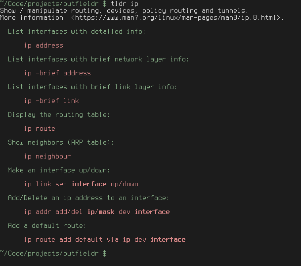

# A [TLDR](https://github.com/tldr-pages/tldr) client in Zig.



This is a fork of [https://gitlab.com/ve-nt/outfieldr](https://gitlab.com/ve-nt/outfieldr) with fixes for Windows compatibility the benchmarks were carried out by the original author.

# Usage

To view the TLDR page for `chmod`:

    tldr chmod


Works with multiple-word pages as well, for example:

    tldr git rebase


Update your local cache (you'll need to do this before using it for the first time):

    tldr --update


To specify language (in this case, español):

    tldr --language es bash


You can specify the platform too, it defaults to the platform the
source was built for.

    tldr --platform osx caffeinate


You can list all pages, as well as supported languages and operating
systems:

    tldr --list
    tldr --list-languages
    tldr --list-platforms


Specifying your language/platform alongside `--list` works as expected.

    tldr --list --language fr --platform linux


Certain arguments may have both shortform and longform options
available. Longform is the default. To display in shortform:

    tldr git add --short-options


To display both shortform and longform options, ask for both:

    tldr git add --short-options --long-options


You can also fetch a random page, just for fun. This respects your
language and platform choice too.

    tldr --random


For more, try:

    tldr --help


# Building

Install [`zig-0.15.1`](https://ziglang.org/download/) and run:

    $ zig build --release=fast -Dtarget=x86_64-native

# Performance

I benchmarked against a few other tldr programs using
[Hyperfine](https://github.com/sharkdp/hyperfine) with the following
command:

```sh
hyperfine --warmup 100 \
	'./tldr-node-client/bin/tldr git commit' \
	'./tldr-c-client/tldr git commit' \
	'./tldr-python-client/tldr.py git commit' \
	'./tlrc/target/release/tldr git commit' \
	'./outfieldr/zig-out/bin/tldr git commit' \
	'./tealdeer/target/release/tldr git commit' \
	'./tinytldr/tldr git-commit'
```

Here are the results:

| Program                                                           | Build Flags      | Mean Time (ms)      | User     | System   |
|:------------------------------------------------------------------|:-----------------|:--------------------|:---------|:---------|
| [Outfieldr](https://gitlab.com/ve-nt/outfieldr)                   | `--release=safe` | 19.9 µs ± 57.5 µs   | 155.0 µs | 183.9 µs |
| [TLRC](https://github.com/tldr-pages/tlrc)                        | `--release`      | 398.8 µs ± 106.2 µs | 240.8 µs | 523.9 µs ]
| [Tealdeer](https://github.com/dbrgn/tealdeer/)                    | `--release`      | 751.0 µs ± 119.7 µs | 324.6 µs | 706.9 µs |
| [C Client](https://github.com/tldr-pages/tldr-c-client)           | `-O3`            | 1.5 ms ± 0.2 ms     | 0.7 ms   | 1.0 ms   |
| [Tinytldr](https://github.com/kovmir/tinytldr)                    | `-O3`            | 2.6 ms ± 0.3 ms     | 1.3 ms   | 1.3 ms   |
| [Python Client](https://github.com/tldr-pages/tldr-python-client) | N/A              | 39.7 ms ± 1.2 ms    | 31.8 ms  | 7.6 ms   |
| [Node.js Client](https://github.com/tldr-pages/tldr-node-client)  | N/A              | 377.9 ms ± 4.7 ms   | 425.2 ms | 92.1 ms  |

Here is the raw log from Hyperfine:

```
Benchmark 1: ./tldr-node-client/bin/tldr git commit
  Time (mean ± σ):     377.9 ms ±   4.7 ms    [User: 425.2 ms, System: 92.1 ms]
  Range (min … max):   365.9 ms … 400.2 ms    1000 runs

Benchmark 2: ./tldr-c-client/tldr git commit
  Time (mean ± σ):       1.5 ms ±   0.2 ms    [User: 0.7 ms, System: 1.0 ms]
  Range (min … max):     1.4 ms …   2.4 ms    1000 runs

Benchmark 3: ./tldr-python-client/tldr.py git commit
  Time (mean ± σ):      39.7 ms ±   1.2 ms    [User: 31.8 ms, System: 7.6 ms]
  Range (min … max):    36.6 ms …  43.2 ms    1000 runs

Benchmark 4: ./tlrc/target/release/tldr git commit
  Time (mean ± σ):     398.8 µs ± 106.2 µs    [User: 240.8 µs, System: 523.9 µs]
  Range (min … max):   317.9 µs … 1154.7 µs    1000 runs

Benchmark 5: ./outfieldr/zig-out/bin/tldr git commit
  Time (mean ± σ):      19.9 µs ±  57.5 µs    [User: 155.0 µs, System: 183.9 µs]
  Range (min … max):     0.0 µs … 725.7 µs    1000 runs

Benchmark 6: ./tealdeer/target/release/tldr git commit
  Time (mean ± σ):     751.3 µs ± 119.7 µs    [User: 324.6 µs, System: 706.9 µs]
  Range (min … max):   664.3 µs … 1579.7 µs    1000 runs

Benchmark 7: ./tinytldr/tldr git-commit
  Time (mean ± σ):       2.6 ms ±   0.3 ms    [User: 1.3 ms, System: 1.3 ms]
  Range (min … max):     2.3 ms …   3.5 ms    1000 runs

Summary
  ./outfieldr/zig-out/bin/tldr git commit ran
   20.06 ± 58.27 times faster than ./tlrc/target/release/tldr git commit
   37.79 ± 109.47 times faster than ./tealdeer/target/release/tldr git commit
   77.67 ± 224.87 times faster than ./tldr-c-client/tldr git commit
  130.92 ± 378.91 times faster than ./tinytldr/tldr git-commit
 1999.62 ± 5783.72 times faster than ./tldr-python-client/tldr.py git commit
19012.19 ± 54988.72 times faster than ./tldr-node-client/bin/tldr git commit
```

# TODO

- [X] Pretty-print tldr pages

- [X] Update the local cache by fetching/extracting a tarball from the tldr repo

- [X] Make language overridable

- [X] Make OS overridable

- [X] Improve help page

- [X] List all available languages

- [X] List all supported operating systems

- [X] List all available pages with small description

- [X] Handle terminals that don't like color

- [ ] Conform to the [TLDR Client Specification](https://github.com/tldr-pages/tldr/blob/main/CLIENT-SPECIFICATION.md)
